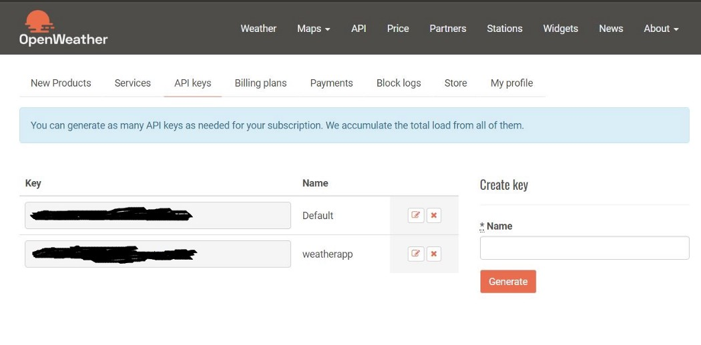
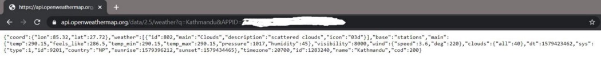
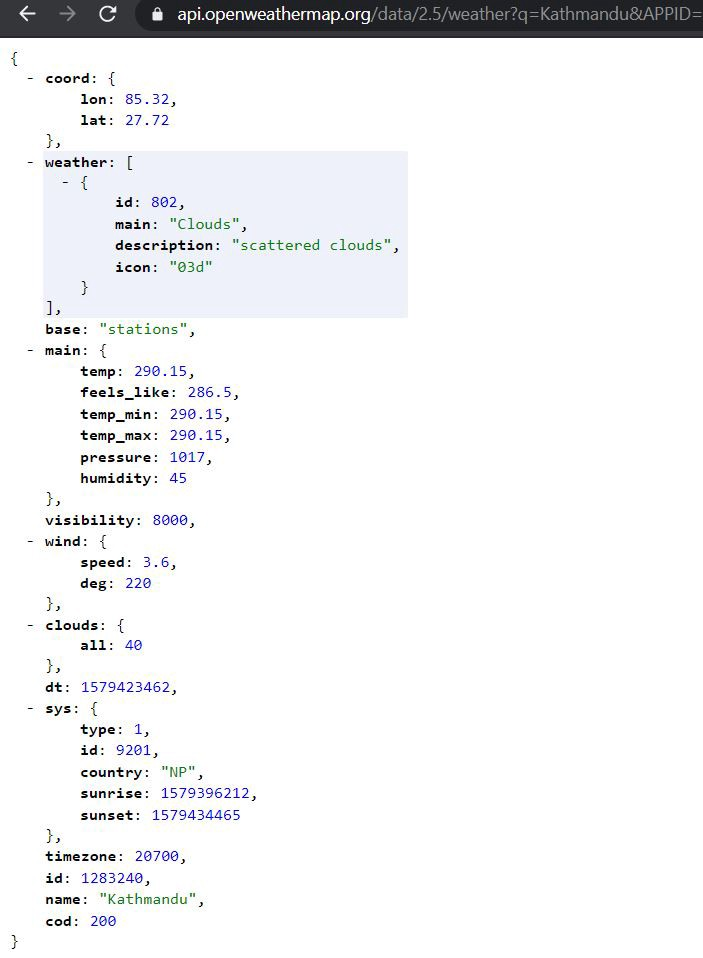
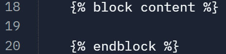
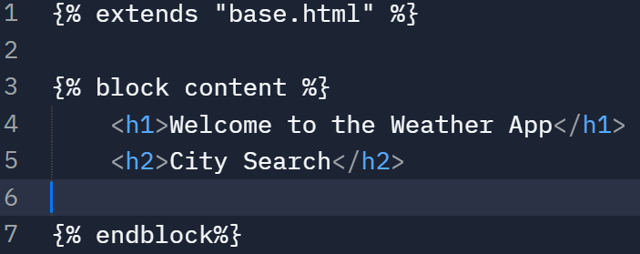
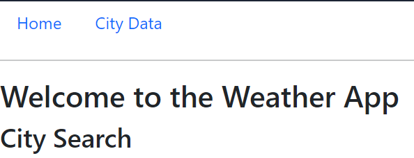
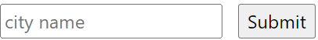
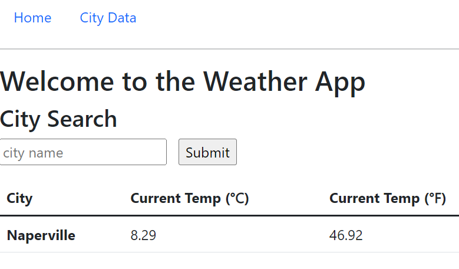
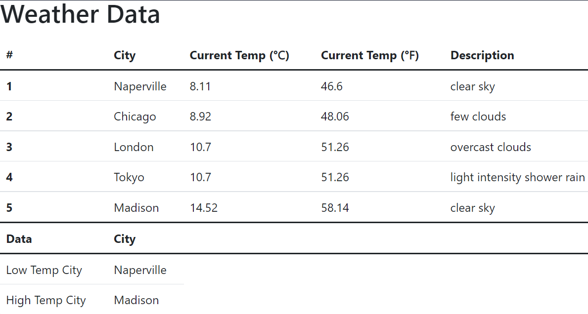

# Making a Weather App
*In this tutorial, you will learn how to make a web app using Flask and the Openweathermap API.*

## Step 1: A starter Web App

**WEB APPLICATION (WEB APP)**: a software application that runs on a web server and is accessed using a web browser. Unlike desktop (e.g. Microsoft Word) and mobile applications (e.g. Snapchat), web apps do not run locally on the operating system of a user's device.

**FLASK** is a minimal Python web app framework designed to make getting started quick and easy, with the ability to scale up to complex applications.

Let's take a look at the starter code we have:

```python
from flask import Flask, request, render_template, redirect, url_for  
import requests
from city import City

cities = []

app = Flask(__name__)

@app.route('/', methods = ['GET'])
def index():
	return "<h1>Hello, World!</h1>"

app.run(host='0.0.0.0', port=8080)
```
	
Press 'run' to see the result.  What did that code do?

First we `import` useful classes and functions from the `flask` module. An instance of the `Flask` class will be our WSGI application. Next we import `requests` which we will use for our API calls. Finally, we import a custom class `City`.

**API (Application Programmer Interface)**: a software intermediary that allows two applications to talk to each other. We will use the [Openweathermap API](https://openweathermap.org/api) to access weather data for our app.

Next we create an instance of the `Flask` class. The first argument is the name of the application’s module or package. `__name__` is a convenient shortcut for this that is appropriate for most cases. This is needed so that Flask knows where to look for resources such as templates and static files.

We then use the `route()` decorator to tell Flask what URL should trigger our function. In this case we use `/` route, which is the default route of any website.

The function returns the message we want to display in the user’s browser. The default content type is HTML, so HTML in the string will be rendered by the browser. The `h1` tag is a level 1 heading in HTML. Try changing the tag to a paragraph using the `p` tag and observe the changes to the app. What did you notice?

## Step 2: Get an API Key

(skip Step 2 if already done) Go to https://home.openweathermap.org/users/sign_up and sign up for a free plan. Then visit the API key section https://home.openweathermap.org/api_keys to get your key. You can use the default key or generate a new one as you wish. You may have to wait for a while to get your key verified.



## Step 3: Making API Calls
A simple way to make requests using the API is using the city name. The url to make a request will look like this:

      http://api.openweathermap.org/data/2.5/weather?q=city_name&APPID=your_api_key
	
You can copy paste the url and replace the `city_name` and `your_api_key` with the appropriate values to see the result. Sample response from Openweather API:



The response will be in JSON. JSON is a lightweight format for storing and transporting data and is often used when data is sent from a server to a web page. It's similar to a Python dictionary in that it stores information in `key:value` pairs. If you want to see a formatted JSON response, you can use a chrome extension called JSONView. Your response will look something like this in browser:




All the data shown are pretty much straightforward. The temperature is shown inside the `main` key. `name` and `id` both can be used to query the API.

For our Weather App, we will allow the user to search for a city and then display weather data for that city back to them.  We will encapsulate this process in a function called `get_data`.  `get_data` has a parameter to accept the name of a city as a string.  The function then returns weather `data` about that city as a list. Add the following to your function to retrieve data on a given city.

```python
	# initialize your API key here
	API_KEY = 'insert_your_API_key_here'

	# request data from API and retrieve json data response
	url = f'http://api.openweathermap.org/data/2.5/weather?q={city}&APPID={API_KEY}'
	response = requests.get(url)
	# convert json response into python dictionary
	response = response.json()
	print(response)
```
Test the function by calling it and passing the string `"Naperville"`.  The print statement should display a dictionary of Naperville weather data to the console.

Next, let's pull only the data we are interested in from the dictionary and add it to our `data` list. First, get the value from the `'main'` key and then the value from the `'temp'` key. If you need help accessing items from the dictionary, [see here](https://runestone.academy/ns/books/published/thinkcspy/Dictionaries/toctree.html).

```python
	# get current temp from dictionary and add it to the data list
	dict = response.get('main')
  current_temp = dict.get('temp')
	data.append(current_temp)

```
Now your function should return a list with the city name and city temperature (in Kelvin).  Test it to make sure it works!

Now, let's get another data point, the weather description, and add it to our data list:

```python
	# get current description from dictionary and add it to the data list
	current_desc = response.get('weather')[0].get('description')
	data.append(current_desc)

```

Test it to make sure it works by adding in strategic print statements. Notice that this data is accessed slightly differently than the temperature (list access is involved). Return the data list when done.

*Extension:* Capture any other data you are interested in using in the app by adding it to the `data` list.

## Step 4: Writing a 'City' class to encapsulate city weather data
Complete the `City` class in the `city.py` file. A `City` should include the following three attributes, at a minimum (make sure the attribute names and order match those below for the unit tests to work):
- `name` - a string with the city name
- `temp_in_K` - a float with the city's current temperature in Kelvin
- `desc` - a string with a description of the current weather conditions. e.g. `'cloudy'`

A `City` should also include the following methods, at a minimum:
- `constructor`
- `string method`
- `get_name`
- `get_desc`
- `get_temp_in_K`
- `get_temp_in_C` - converts `temp_in_K` to Celcius and returns it
- `get_temp_in_F` - converts `temp_in_K` to Fahrenheit and returns it

When done, run the unit tests to check if you have written the class correctly. 4/4 tests should pass before moving on.

*Extension:* Capture any other data/methods you are interested in using in the app by adding it to the `City` class.

## Step 5: Formatting the app content with HTML & CSS
Now we want a way to enter a city name into our app and get the current weather for that place. For that we will have to create a search box, get the city name from the search, get weather data from the API, and display it back in the browser.

**HTML & CSS**

HTML, hyper-text markup language, is a markup language used for formatting and displaying content on web pages.  CSS, cascading style sheets, is a language to style html content to make it more presentable to the user.  We'll use HTML to format our content and CSS to style it to look better.  A `base.html` file has been written for you, but it will be important to understand how it works and interacts with the app.

We are using a best practice called html templates.  They provide a way to create some base html content for a page in our app.  Review the `base.html` file.  Notice the block content section:



We will be able to insert content into this block using a separate html file, like the `index.html` file that has been started for you:



Now, change the app to use the `index.html` file.  Instead of returning the html string with "Hello, World", return the following:
```python
return render_template('index.html')
```

You should see something like this:


Notice that the HTML file has styling applied even though there is no CSS file in our project. 
 Instead of using our own CSS file, we are using a popular CSS framework called [Bootstrap](https://getbootstrap.com/docs/5.1/getting-started/introduction/). It's linked to our files in the `<head>` of the `base.html` file and uses CSS classes (`class=""`) to apply styling.  Check out the `base.html` file to see how this works!

*Extension*: Explore other [Bootstrap](https://getbootstrap.com/docs/5.1/getting-started/introduction/) classes and customize the app's appearance.

## Step 6: Adding search functionality

Notice that the associated `method` for our index function is `['GET']`.  This is an HTTP method.  HTTP is the protocol of the World Wide Web and enables communication between clients and servers. Read about HTTP methods `GET` and `POST` [here](https://www.w3schools.com/tags/ref_httpmethods.asp). We will be using `GET` requests to load resources from our server (e.g. the `index.html` file) and `POST` requests to submit form data to our server (e.g. like when we search for a city).

The search feature will be an html `<form>` element with an `<input >` field and submit button.  They display on the web page and allow the user to enter information and submit it.  Add this form to the `index.html` file:

```html
	<form action="" method="post">
	<input type="text" name="search_box" placeholder="city name"> &nbsp;
	<input type="submit" value="Submit">
</form>
```
When done, test it to make sure the app display the following fields:


When we search, we will display the results from our search in a table.  Add the following html below the `<form>` tags:
```html
	<table class="table">
  <thead>
    <tr>
    	<th scope="col">City</th>
    	<th scope="col">Current Temp (&#8451;)</th>
    	<th scope="col">Current Temp (&#8457;)</th>
    </tr>
  </thead>
<tbody>
```
This will be the table header, or `<thead>`. Each row in a table is a `<tr>`. Now let's add a table body:
```html
	<tbody>
	<tr>
      <th scope="row">data</th>
      <td>data</td>
      <td>data</td>
    </tr>
</tbody>
```
This is dummy data, which we will replace with our actual data from the API later.

Next, let's `POST` information from our client form to the server. Add a new `route` to the Web App for the `POST`:
```python
@app.route('/', methods = ['POST'])
def index2():
	# get the city name from the form's search box
	city_str = request.form["search_box"]
	print(city_str)

	return render_template('index.html', city = city_str)
```

This code will run when we submit the html `form`. Run the app and submit the city `"Naperville"` into the form. If `"Naperville"` prints to the console then it is working!

To get information over to the app we can use html templating, like this:
```python
	return render_template('index.html', city = city_str)
```

By passing the `city_str` to the `render_template` function as the variable `city`, we can now use `city` in our html as follows:
```html
	<tbody>

	<tr>
      <th scope="row">{{ city.title() }}</th>
      <td>{{ city.lower() }}</td>
      <td>{{ city.upper() }}</td>
    </tr>

  </tbody>
</table>

```

`` is just like a Python if statement.  This will only run if the `city` variable has a value assigned to it. Unliike Python, this if block also includes an ``, indicating the scope, or end, of the if block.

A [similar technique](https://jinja.palletsprojects.com/en/3.0.x/templates/) can be used with for loops. This will be valuable in Step 8! e.g.

```html
<ul>
	
  <li> City Name: {{ city.get_name() }}</li>
	
</ul>
```

## Step 7: Capturing weather data and displaying in the app
Now that we have a city name, we can get it's weather data using our `get_data` function. Call `get_data` with the `city_str`, create a `City` object to capture the weather data using your `City` class, and add that city to the global `cities` list.  This allows us to capture and store information about all cities that have been searched.

Using the html templating technique, get the data from the most recent city to display in the table accurately. Hint: You can pass objects to html templates just like you passed a string. When finished, the app should produce accurate weather data for a given city:



*Extension*: add more data points to the app

## Step 8: Multiple endpoints
Did you notice the navigation link to City Data in the app?  Did you also notice that it doesn't work? Time to change that!

Make a new `route` that will display all city weather data from your app search history. This `route` should be to a new file called `cities.html`. 
```python
@app.route('/cities.html', methods = ['GET'])
def page2():
	# insert page 2 code here
	return render_template("cities.html")
```
This new route should have the following features:
- Cities are numbered from first search to most recent search 
- All columns included
- No duplicate cities show up if you search for the same city twice
- The high and low temperature cities from your search history display in a separate table (see *max* and *min* algorithms)

It should look like this:



*Extensions*: Add more awesome!

## Extensions

Explore embedded extensions in the steps above.

Add a new `route` to the app.

To learn more Flask, checkout the [official guide](https://flask.palletsprojects.com/en/2.0.x/quickstart/). 

Explore more API data on [OpenWeatherMap](https://openweathermap.org/api). 


Tutorial adapted from a [Towards Data Science Article](https://towardsdatascience.com/building-a-weather-app-using-openweathermap-and-flask-ed7402239d83).
